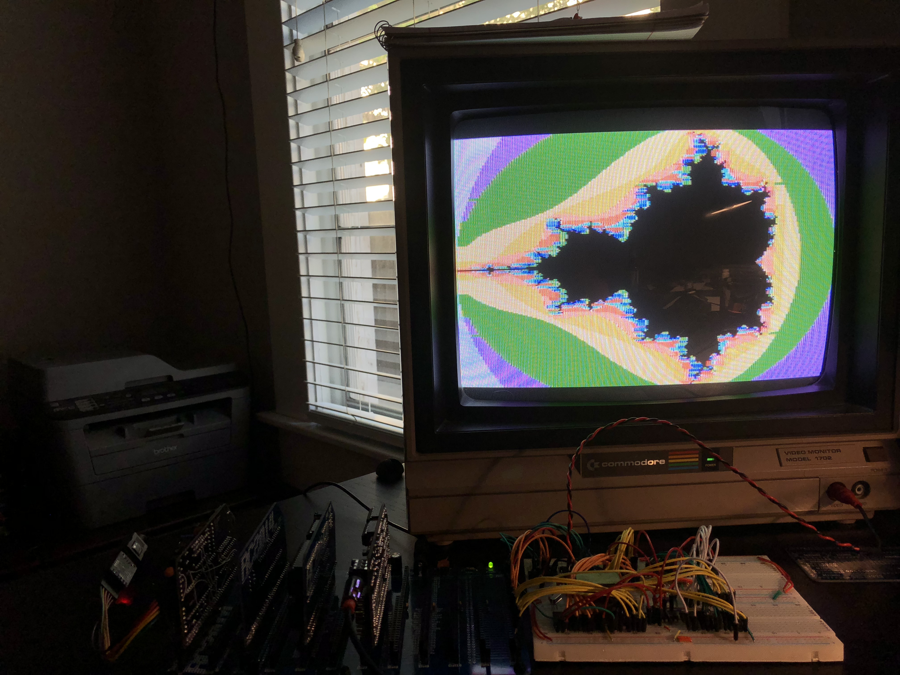

# rc9918

This is a TMS9981A-based video card for the RC2014. I have breadboarded the circuit and confirmed that it works; however, the PCB layout is currently untested, so manufacture at your own risk until further notice.

This is based on a [circuit](https://retrobrewcomputers.org/n8vem-pbwiki-archive/0/35845334/48860720/33053543/SRAM%20Replacement%20for%20TMS99x8%20VRAM.pdf) described by Tom LeMense for interfacing the TMS9918A with SRAM.

The TMS9918 data and control ports map to 98 and 99, respectively. Since the original MSX had the TMS9918A mapped to the same ports, this should hopefully be compatible with some software written 
for the MSX.

I have included an example Z80 assembly program, [tmsmandel.asm](tmsmandel.asm), which generates a Mandelbrot on the TMS9918.

I am also adding support for the TMS9918 to my [z80ctrl](https://github.com/jblang/z80ctrl) project.

Resources:

- [TMS9918 Manual](http://map.grauw.nl/resources/video/texasinstruments_tms9918.pdf)
- [TI VDP Programmer's Guide](http://map.grauw.nl/resources/video/ti-vdp-programmers-guide.pdf)
- [More TMS9918 Documents](https://github.com/cbmeeks/TMS9918)
- [Discussion Thread](https://groups.google.com/d/topic/rc2014-z80/0m0kbzIJ3tw/discussion)

