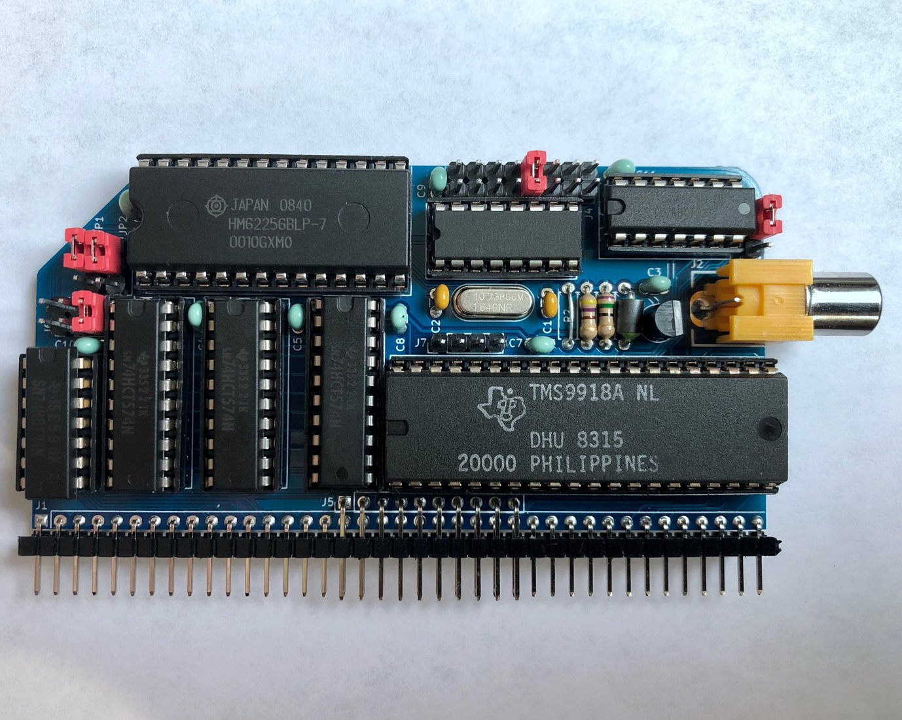

# TMS9918A Video Card for RC2014

This is a TMS9918A-based video card for [RC2014](https://rc2014.co.uk/) and [SC1xx](https://smallcomputercentral.wordpress.com/) computers based on the Z80 and Z180 processors. The TMS9918A produces NTSC composite graphics and was used in the TI-99/4A, MSX, ColecoVision, and Sega SG-1000. Enhanced derivatives were used in later MSX2 computers, the Sega Master System, and the Sega Genesis.

This board is based on a [circuit](https://retrobrewcomputers.org/n8vem-pbwiki-archive/0/35845334/48860720/33053543/SRAM%20Replacement%20for%20TMS99x8%20VRAM.pdf) described by Tom LeMense for interfacing the TMS9918A with SRAM.  I started with his schematics, added port address decoding and laid out the circuit on an RC2014 module.

This board can be configured to use the same ports as the MSX or ColecoVision, so it's possible to run some software from these systems, such as [ColecoVision games](https://hackaday.io/project/159057-game-boards-for-rc2014/log/156298-running-colecovision-games) and [MSX-BASIC](https://hackaday.io/project/158338-z80ctrl/log/157750-msx-basic-on-rc2014).

## Assembly Instructions

[Ready-to-Assemble Kits](https://www.tindie.com/products/mfkamprath/tms9918a-video-module-for-rc2014/) are available on Tindie.  These are sold by Michael Kamprath with my permission.  However, I offer no warranty or guarantee of support.

[Gerbers](https://cdn.hackaday.io/files/1590576805094688/TMS9918_rev4_gerbers.zip) for the PCB are available. I highly recommend [JLCPCB](https://jlcpcb.com/) for PCB fabrication. Alternatively, boards can be ordered from the shared project on [OSH Park](https://oshpark.com/shared_projects/mwSt2s6V).

Refer to the [schematic](TMS9918.pdf), the picture below, and the bill of materials below for assembly guidance.

### Bill of Materials

| Component | Description |
|---|---|
| PCB | rc9918 PCB |
| U1 | 74HCT32 quad OR gate |
| U2 | 74HCT138 3-8 line decoder |
| U3 | TMS9918A video chip |
| U4 | 74HCT04 hex inverter |
| U5, U6, U7 | 74HCT574 octal flip-flops |
| U8 | AS6C62256-55PCN, HM62256BLP-7, UM61M256K-15, or other compatible 32KB SRAM.  I have put two footprints so either a wide or narrow DIP-28 will work as long as the pin-out is the same. |
| R1 | 75 ohm resistor |
| R2 | 130 ohm resistor* |
| R3 | 470 ohm resistor |
| L1 | Ferrite bead (FBA04HA600VB-00 or similar) |
| Y1 | 10.73866MHz crystal (LFXTAL029962REEL or similar) |
| C1, C2 | 16pf ceramic or MLCC capacitor |
| C3-C11 | 0.1uf ceramic or MLCC capacitor |
| Q1 | NPN transistor (2N4401 or similar) |
| J1 & J5 | 2x40 pin right angle header, with pins from upper row removed to fit J5 |
| J2 | KLPX-0848A-2-Y RCA connector |
| J4 | 2x8 pin straight header and 1 jumper block |
| J6 | 2x3 pin straight header and 1 jumper block |
| J7 | 1x4 pin straight header and 1 jumper block |
| JP1 | 1x3 pin straight header and 1 jumper block |
| JP2 | 1x3 pin straight header and 1 jumper block |
| JP4 | 1x3 pin straight header and 1 jumper block |
| D1 | REV4 only: Schottky diode (BAT81 or similar) |

* This resistor value controls the voltage of the NTSC signal, and therefore the brightness of the picture. Tom Lemense's original circuit specified a 0 ohm resistor (i.e., wire link), but based on my measurements this will result in a voltage higher than NTSC spec and the picture will be too bright. I found that 130 ohm yields a voltage close to NTSC spec.  Higher values will be dimmer and lower values will be brighter.

Aside from the board and the TMS9918A itself, all parts are available from Mouser and probably other suppliers as well.

## Recommended Jumper Configurations
The following jumper configurations are recommended for compatibility with unmodified software for classic machines using the TMS9918A.  The function of each jumper is described in more detail in the section following the table.

The provided example programs automatically detect the TMS9918A on any of the following ports, so no change to the example code is necessary.

|  | ColecoVision / SG-1000 | MSX | Sord M5 | Tatung Einstein | 
|---|---|---|---|---|
| Ports | B0-BF* | 98/99 | 10/11** | 08/09 |
| `J4` (A7-A5) | 2nd from right (101) | 3rd from right (100) | Far left (000) | Far left (000) |
| `J6` (A4) | Right (1) | Right (1) | Right (1) | Middle (0) |
| `JP2` (A3) | Lower (X) | Upper (1) | Lower (X) | Upper (1) |
| `JP1` (A2-A1) | Lower (XX) | Upper (00) | Upper (00) | Upper (00) |
| `JP4` (Interrupt) | Lower (NMI) | Upper (INT) | Lower (NMI) | Upper (INT) |

\* On a real ColecoVision, the entire A0-BF range is assigned to the TMS9918A, but since all known games only use ports BE and BF, address decoding can be limited to B0-BF.  If you want to decode the full range A0-BF, place J6 in the left position instead.

\** On a real Sord M5, only ports 10 and 11 are assigned to the TMS9918A, but since the address decoding for bit 3 can only be set to 1 or don't care, this configuration assigns both 10/11 and 18/19 to the TMS9918A.

Note: This board cannot decode the port addresses used by the MTX (not to be confused with MSX) and Spectravideo SV-3xx machines, so it not compatible with unmodified software for these machines.

## Jumper Descriptions

### Port Address Jumpers

The Z80 uses 8 bit I/O addresses.  Four jumpers on this board control which I/O addresses the TMS9918A is assigned to. Each jumper controls one or more bits within the address:

* `J4` configures A7-A5 which lets you select a block of 32 addresses from 00-1F (left) to E0-FF (right). 
* `J6` configures A4. There are 3 options: don't care (left), 0 (middle), or 1 (right). This lets you choose the entire 32 address range selected by J4, the lower half, or the upper half, respectively. 
* `JP2` configures A3. In the upper position, it must be 1. In the lower position, it is don't care.  
* `JP1` configures A2 and A1. In the upper position, they must both be 0. In the lower position, they are don't care.
* There is no jumper for A0. When A0 is low (0) the VRAM is addressed, when it is high (1), the VDP control register is addressed.

### Interrupt Configuration Jumper
The jumper `JP4` is used to determine whether to send the TMS9918A interrupt signal to either INT (upper position) or NMI (lower position) on the RC2014 bus. 

**Warning**: The TMS9918A does not have an open collector interrupt output. If you have other cards that make use of the /INT line, such as the SIO card that comes with the RC2014, it's possible the TMS9918A will fight with other chips for control of the interrupt line, which will prevent proper operation and could potentially damage both chips. For safety, it is recommended to use NMI instead of INT in this case. REV4 of the board adds a diode to prevent hardware damage; however, if multiple peripherals are generating interrupts, it could still lead to unpredictable software behavior.

### Clock Header
The optional `J7` header has pins (from left to right) for RC2014 CLK1 (REV4 only), CPUCLK, GROMCLK, EXTVDP, and GND. **No jumper block should normally be placed on this header.**

These pins can be used as follows:

- CPUCLK and GROMCLK provide 3.58MHz and 447 kHz clock signals, respectively. A jumper block can be placed on the RC2014 CLK1 and CPUCLK pins to use the TMS9918A's clock output as the RC2014's system clock (be sure to remove other clock sources if you do this). The clock signals could also be used by other boards via jumper cables.

- It should also be possible to daisy-chain multiple TMS9918A chips using the EXTVDP signal, or to genlock an external video source. The extra GND pin can be used with an external video source if needed.  

## Resources

- [TMS9918 Manual](http://map.grauw.nl/resources/video/texasinstruments_tms9918.pdf)
- [TI VDP Programmer's Guide](http://map.grauw.nl/resources/video/ti-vdp-programmers-guide.pdf)
- [More TMS9918 Documents](https://github.com/cbmeeks/TMS9918)
- [Discussion Thread](https://groups.google.com/d/topic/rc2014-z80/0m0kbzIJ3tw/discussion)
- [Hackaday Page](https://hackaday.io/project/159057-rc9918)
- [Example Assembly Programs](examples)

## Other Boards

- [SN76489 Sound Card](https://github.com/jblang/SN76489): my SN76489 sound card for the RC2014
- [Game Controller Card](https://github.com/jblang/GameController): my Atari/Coleco/Sega-compatible controller interface for the RC2014
- [z80ctrl](https://github.com/jblang/z80ctrl): my AVR-based bus monitor and bootloader board for the RC2014

## License

Copyright 2018-2020 J.B. Langston

Permission is hereby granted, free of charge, to any person obtaining a copy of this software and associated documentation files (the "Software"), to deal in the Software without restriction, including without limitation the rights to use, copy, modify, merge, publish, distribute, sublicense, and/or sell copies of the Software, and to permit persons to whom the Software is furnished to do so, subject to the following conditions:

The above copyright notice and this permission notice shall be included in all copies or substantial portions of the Software.

THE SOFTWARE IS PROVIDED "AS IS", WITHOUT WARRANTY OF ANY KIND, EXPRESS OR IMPLIED, INCLUDING BUT NOT LIMITED TO THE WARRANTIES OF MERCHANTABILITY, FITNESS FOR A PARTICULAR PURPOSE AND NONINFRINGEMENT. IN NO EVENT SHALL THE AUTHORS OR COPYRIGHT HOLDERS BE LIABLE FOR ANY CLAIM, DAMAGES OR OTHER LIABILITY, WHETHER IN AN ACTION OF CONTRACT, TORT OR OTHERWISE, ARISING FROM, OUT OF OR IN CONNECTION WITH THE SOFTWARE OR THE USE OR OTHER DEALINGS IN THE SOFTWARE.
